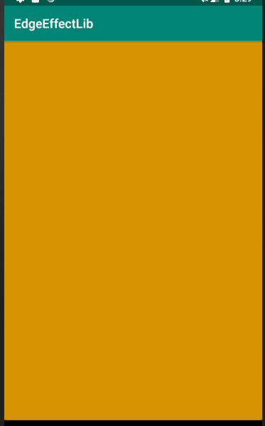

## 辅助制造EdgeEffect效果

```
implementation 'tech.liujin:edgeeffectutil:1.0.0'
```


### 使用

* 创建

```
mEffectUtil = new EdgeEffectUtil( view, w, h ); --> 使用一个view创建
```

* 在view的onDraw方法中添加绘制

```
@Override
protected void onDraw ( Canvas canvas ) {
      super.onDraw( canvas );
      /* 绘制效果 */
      mEffectUtil.onDraw( canvas );
}
```

* 根据触摸事件触发效果

```
@Override
public boolean onTouchEvent ( MotionEvent event ) {
      switch( event.getAction() ) {
            case MotionEvent.ACTION_DOWN:
                  mDownX = event.getX();
                  mDownY = event.getY();
                  break;
            case MotionEvent.ACTION_MOVE:
                  float dx = event.getX() - mDownX;
                  float dy = event.getY() - mDownY;
                  
                  /* 在移动的时候,触发pull */
                  float deltaDistanceX = dx / ( getWidth() );
                  float deltaDistanceY = dy / ( getHeight() );
                  
                  if( Math.abs( dx ) >= Math.abs( dy ) ) {
                        if( deltaDistanceX > 0 ) {
                              mEffectUtil.pullLeft( deltaDistanceX );
                        } else {
                              mEffectUtil.pullRight( deltaDistanceX );
                        }
                  } else {
                        if( deltaDistanceY > 0 ) {
                              mEffectUtil.pullTop( deltaDistanceY );
                        } else {
                              mEffectUtil.pullBottom( deltaDistanceY );
                        }
                  }
                  break;
            default:
                  /* 及时释放回弹 */
                  mEffectUtil.release();
                  break;
      }
      super.onTouchEvent( event );
      return true;
}
```

## 效果

